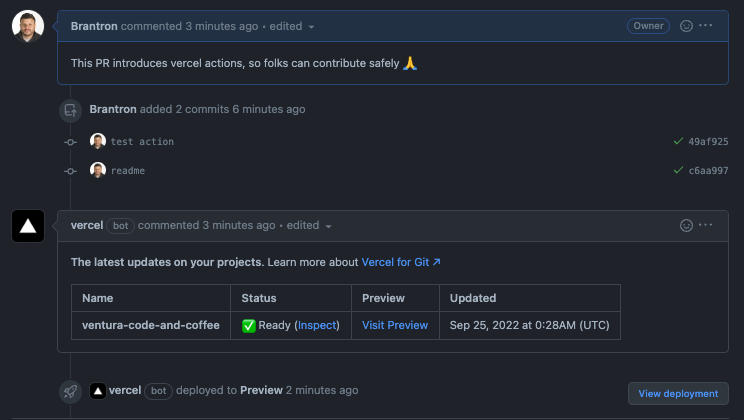

# Ventura Code and Coffee Website

### Welcome!

This is the codebase that powers the website for the Ventura Code & Coffee meetup!

- [Website](https://www.venturacodeand.coffee)
- [Meetup](https://www.meetup.com/ventura-code-coffee/)

The underlying technologies here are:

- [Remix](https://remix.run/docs)
- [React](https://reactjs.org/)
- [Typescript](https://www.typescriptlang.org/)

## Development

To run our website locally, make sure your project's local dependencies are installed:

```sh
npm install
```

Afterwards, start the development server like so:

```sh
npm run dev
```

Open up [http://localhost:3000](http://localhost:3000) and you should be ready to go!

### Contributing

Anyone is welcome to contribute. When your feature branch is ready for review, please open a pull request. When you open a pull request, a version of the website including your changes will be made available for review via the vercel bot comment that is added to your pull request.

Please ensure the build is successful before asking for review 🙏.

### Example:



### Troubleshooting:

Q: My Pull request is failing for a prettier error. What do I do?

A: This codebase is setup to ensure we adhere to a set of coding standards using [prettier](https://prettier.io/). Running "npm install" should configure git to fix your files when you commit them. If there are any issues, please open a [bug report](https://github.com/Brantron/ventura_code_and_coffee/issues/new?assignees=&labels=&template=bug_report.md&title=)
